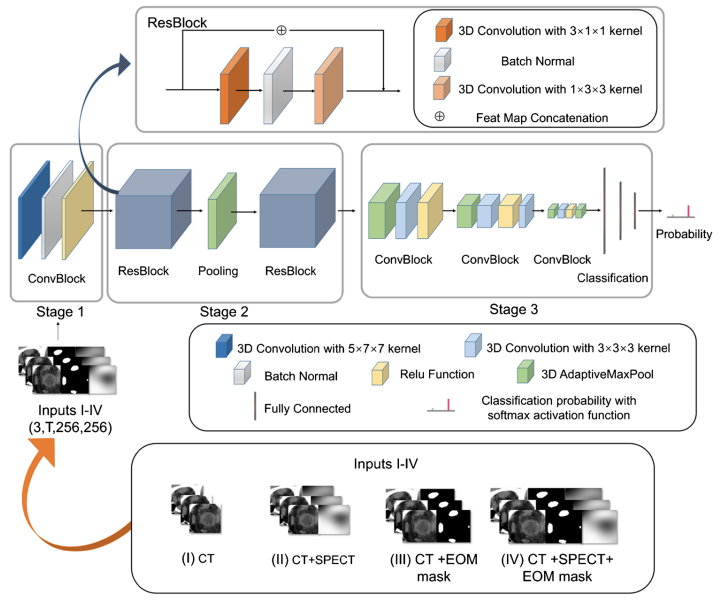

# PyTorch Implementation of GONet (for performance comparison in paper "Multihead Neural Network for Multiple Segmented Images-based Diagnosis of Thyroid-associated Orbitopathy Activity")
 
The preprocessing and architecture can be referenced by a manuscript entitled, ""Deep learning-based diagnosis of disease activity in patients with Graves’ orbitopathy using orbital SPECT/CT." 

## Overview
This repository contains an unofficial implementation of GONet using PyTorch.<br/>


## Neural Network Block

## Paper
If you use this software for your research, please cite:

```bibtex
@article{yao2023deep,
  title={Deep learning-based diagnosis of disease activity in patients with Graves’ orbitopathy using orbital SPECT/CT},
  author={Yao, Ni and Li, Longxi and Gao, Zhengyuan and Zhao, Chen and Li, Yanting and Han, Chuang and Nan, Jiaofen and Zhu, Zelin and Xiao, Yi and Zhu, Fubao and others},
  journal={European journal of nuclear medicine and molecular imaging},
  volume={50},
  number={12},
  pages={3666--3674},
  year={2023},
  publisher={Springer}
}
```

## License
This program is available for download for non-commercial use, licensed under the GNU General Public License. This allows its use for research purposes or other free software projects but does not allow its incorporation into any type of commercial software.

## Files
The repository contains the following files:
- `GONet.py`: Python script file, containing the PyTorch implementation of the GONet
- `GONet.png`: Figure file for network block
- `README.md`: Markdown file explaining the model source code
